# LiftLog System Diagrams

This document contains textual representations and descriptions of key diagrams for the LiftLog fitness tracking mobile application system.

## Context Diagram

**Description:**  
The Context Diagram shows the LiftLog system in its environment, illustrating the interactions between the system and external entities. The system serves users (members, trainers, and admins) who access it via a mobile app. The backend interacts with MongoDB Atlas for data persistence, Supabase for file storage (e.g., videos), and is deployed on Render. External entities include users, database services, and deployment platforms.

**Textual Representation:**

```
+-------------------+     +-------------------+     +-------------------+
|       User        | --> | LiftLog Mobile App| --> | LiftLog Backend   |
| (Member/Trainer/  |     |   (Flutter)       |     | API (Express)     |
|  Admin)           |     +-------------------+     +-------------------+
+-------------------+                                   |
                                                         |
                                                         v
                                               +-------------------+
                                               |   MongoDB Atlas   |
                                               |   (Database)      |
                                               +-------------------+

                                               +-------------------+
                                               |   Supabase        |
                                               |   (File Storage)  |
                                               +-------------------+

                                               +-------------------+
                                               |   Render          |
                                               |   (Deployment)    |
                                               +-------------------+
```

## Flowchart (Hardware and System)

**Description:**
This flowchart illustrates the hardware and system-level data flow within LiftLog. It shows how user interactions on the mobile device flow through the system components, including API calls, database operations, and storage interactions. The flow covers authentication, data retrieval/storage, and response handling, with detailed branches for different user roles and actions.

**Mermaid Flowchart:**

```mermaid
flowchart TD
    A[App Launch] --> B{Token Exists?}
    B -->|Yes| C[Validate Token via API]
    B -->|No| D[Login/Register Screen]

    C -->|Valid| E[Dashboard Based on Role]
    C -->|Invalid| F[Remove Token] --> D

    D --> G[User Inputs Credentials]
    G --> H[API Call: POST /api/auth/login or /register]
    H --> I[Backend: Auth Route]
    I --> J{User Exists? / Valid Credentials?}
    J -->|No| K[Return Error]
    J -->|Yes| L{Check Membership / Role}
    L -->|Fail| K
    L -->|Pass| M[Generate JWT Token]
    M --> N[Return Token & User Data]
    N --> O[Store Token Locally]
    O --> E

    E --> P{User Role?}
    P -->|Member| Q[Member Actions]
    P -->|Trainer| R[Trainer Actions]
    P -->|Admin| S[Admin Actions]

    Q --> T[View Workouts: GET /api/workouts]
    Q --> U[Log Progress: POST /api/progress]
    Q --> V[View Videos: GET /api/videos]
    Q --> W[Settings: GET /api/auth/profile]

    R --> X[Create Workout Template: POST /api/workouts/template]
    R --> Y[Upload Video: POST /api/videos via Presign]
    R --> Z[View Member Progress: GET /api/progress/user/:id]
    R --> AA[Manage Videos: GET /api/videos/trainer]

    S --> BB[User Management: GET /api/auth/users]
    S --> CC[Update Membership: PATCH /api/auth/membership/:id]
    S --> DD[View Reports: Various Admin Queries]

    T --> EE[Backend: Workouts Route]
    EE --> FF[Verify Token & Role]
    FF --> GG[Query MongoDB: Workouts Collection]
    GG --> HH[Return Workouts Data]
    HH --> II[Display Workouts List]

    U --> JJ[Backend: Progress Route]
    JJ --> KK[Verify Token]
    KK --> LL[Create Progress Document]
    LL --> MM[Save to MongoDB: Progress Collection]
    MM --> NN[Return Success]
    NN --> OO[Update UI: Progress Logged]

    V --> PP[Backend: Videos Route]
    PP --> QQ[Verify Token]
    QQ --> RR[Query MongoDB: ExerciseVideos Collection]
    RR --> SS[Return Videos List]
    SS --> TT[Display Videos]

    X --> UU[Backend: Workouts Route]
    UU --> VV[Check Role: Trainer]
    VV --> WW[Create Workout Document]
    WW --> XX[Save to MongoDB]
    XX --> YY[Return Template Created]
    YY --> ZZ[Update UI]

    Y --> AAA[API Call: POST /api/presign]
    AAA --> BBB[Backend: Presign Route]
    BBB --> CCC[Generate Supabase Upload URL]
    CCC --> DDD[Return Presigned URL]
    DDD --> EEE[Upload Video to Supabase]
    EEE --> FFF[API Call: POST /api/videos]
    FFF --> GGG[Backend: Videos Route]
    GGG --> HHH[Create ExerciseVideo Document]
    HHH --> III[Save to MongoDB]
    III --> JJJ[Return Video Uploaded]
    JJJ --> KKK[Update UI]

    Z --> LLL[Backend: Progress Route]
    LLL --> MMM[Check Role: Trainer/Admin]
    MMM --> NNN[Query MongoDB: Progress Collection]
    NNN --> OOO[Return User Progress]
    OOO --> PPP[Display Progress Charts]

    BB --> QQQ[Backend: Auth Route]
    QQQ --> RRR[Check Role: Admin]
    RRR --> SSS[Query MongoDB: Users Collection]
    SSS --> TTT[Return Users List]
    TTT --> UUU[Display User Management]

    CC --> VVV[Backend: Auth Route]
    VVV --> WWW[Check Role: Admin]
    WWW --> XXX[Update User Document]
    XXX --> YYY[Save to MongoDB]
    YYY --> ZZZ[Return Updated User]
    ZZZ --> AAAA[Update UI]

    W --> BBBB[Backend: Auth Route]
    BBBB --> CCCC[Verify Token]
    CCCC --> DDDD[Query MongoDB: Users Collection]
    DDDD --> EEEE[Return Profile Data]
    EEEE --> FFFF[Display Profile]

    AA --> GGGG[Backend: Videos Route]
    GGGG --> HHHH[Check Role: Trainer]
    HHHH --> IIII[Query MongoDB: Videos by Trainer]
    IIII --> JJJJ[Return Trainer Videos]
    JJJJ --> KKKK[Display Manage Videos]

    DD --> LLLL[Backend: Multiple Routes]
    LLLL --> MMMM[Aggregate Data from MongoDB]
    MMMM --> NNNN[Return Reports Data]
    NNNN --> OOOO[Display Reports]

    K --> PPPP[Show Error Message]
    PPPP --> G

    subgraph "Mobile App (Flutter)"
        A
        B
        C
        D
        E
        G
        O
        Q
        R
        S
        T
        U
        V
        W
        X
        Y
        Z
        AA
        BB
        CC
        DD
        II
        OO
        TT
        ZZ
        KKK
        PPP
        UUU
        AAAA
        FFFF
        KKKK
        OOOO
    end

    subgraph "API Service"
        H
        T
        U
        V
        X
        AAA
        FFF
        Z
        BB
        CC
        W
        AA
        DD
    end

    subgraph "Backend (Express.js)"
        I
        EE
        JJ
        PP
        UU
        BBB
        GGG
        LLL
        QQQ
        VVV
        BBBB
        GGGG
        LLLL
    end

    subgraph "Middleware"
        FF
        KK
        QQ
        VV
        MMM
        RRR
        WWW
        CCCC
        HHHH
    end

    subgraph "Database (MongoDB Atlas)"
        GG
        MM
        RR
        XX
        III
        NNN
        SSS
        XXX
        DDDD
        IIII
        MMMM
    end

    subgraph "File Storage (Supabase)"
        EEE
    end

    subgraph "Responses"
        N
        HH
        NN
        SS
        YY
        CCC
        JJJ
        OOO
        TTT
        ZZZ
        EEEE
        JJJJ
        NNNN
    end
```



## Database Schema

**Description:**  
The Database Schema represents the data models and their relationships in MongoDB. The system uses Mongoose schemas for User, Workout, Progress, and ExerciseVideo collections. Relationships include references between users and their workouts/progress/videos.

**Textual Representation (ER Diagram Style):**

```
+-------------------+       +-------------------+
|       User        |       |     Workout       |
+-------------------+       +-------------------+
| _id (ObjectId)    |<--1--*| _id (ObjectId)    |
| username          |       | user (ref User)   |
| email             |       | trainer (ref User)|
| password          |       | date              |
| role              |       | title             |
| membershipStart   |       | description       |
| membershipExp     |       | exercises[]       |
| profile           |       | duration          |
|                   |       | caloriesBurned    |
|                   |       | intensity         |
|                   |       | category          |
|                   |       | isPublic          |
+-------------------+       +-------------------+
          |                           |
          | 1..*                      | 1..*
          v                           v
+-------------------+       +-------------------+
|     Progress      |       |  ExerciseVideo    |
+-------------------+       +-------------------+
| _id (ObjectId)    |       | _id (ObjectId)    |
| user (ref User)   |       | title             |
| bmi               |       | description       |
| caloriesIntake    |       | trainer (ref User)|
| calorieDeficit    |       | videoUrl          |
| weight            |       | videoPath         |
| bodyFatPercentage |       | exerciseType      |
| muscleMass        |       | difficulty        |
| date              |       | duration          |
|                   |       | tags[]            |
|                   |       | isPublic          |
|                   |       | status            |
+-------------------+       +-------------------+
```

**Key Relationships:**
- User has many Workouts (as user or trainer)
- User has many Progress entries
- User (trainer) has many ExerciseVideos
- Workout contains embedded Exercises

## Use Case Diagram

**Description:**  
The Use Case Diagram identifies the main actors and their interactions with the system. Actors include Members (regular users), Trainers (content creators), and Admins (system managers). Use cases cover core functionalities like authentication, workout management, progress tracking, and video handling.

**Textual Representation:**

```
+-------------------+     +-------------------+
|     Member        |     |     Trainer       |
+-------------------+     +-------------------+
| - Register        |     | - Register        |
| - Login           |     | - Login           |
| - View Profile    |     | - View Profile    |
| - Create Workout  |     | - Create Workout  |
| - Track Progress  |     | - Upload Video    |
| - View Videos     |     | - Manage Videos   |
| - View Workouts   |     | - View Progress   |
+-------------------+     +-------------------+
          \                   /
           \                 /
            \               /
             \             /
              \           /
               \         /
                \       /
                 \     /
                  \   /
                   \ /
            +-------------------+
            |   LiftLog System  |
            +-------------------+
                   / \
                  /   \
                 /     \
                /       \
               /         \
              /           \
             /             \
            /               \
           /                 \
+-------------------+     +-------------------+
|      Admin         |     |   System         |
+-------------------+     +-------------------+
| - Login           |     | - Authenticate    |
| - Manage Users    |     | - Store Data      |
| - Update Membership|    | - Process Videos  |
| - View Reports    |     | - Generate Reports|
+-------------------+     +-------------------+
```

**Main Use Cases:**
- Authentication: Register, Login, Update Profile
- Workout Management: Create, View, Edit Workouts
- Progress Tracking: Log Progress, View Charts
- Video Management: Upload, View, Manage Videos
- User Management: Admin functions for user oversight

## Architecture Diagram

**Description:**  
The Architecture Diagram shows the layered architecture of LiftLog. It follows a client-server model with a mobile frontend, RESTful API backend, and distributed data storage. The system uses microservices-like separation with clear boundaries between presentation, application, and data layers.

**Textual Representation:**

```
+-------------------+
|   Presentation    |
|   Layer           |
+-------------------+
| - Flutter Mobile  |
|   App             |
| - UI Components   |
| - State Mgmt      |
|   (Provider)      |
+-------------------+
          |
          | HTTP/HTTPS
          v
+-------------------+
| Application Layer |
+-------------------+
| - Express.js API  |
| - Routes          |
| - Middleware      |
| - Business Logic  |
+-------------------+
          |
          | Database Queries
          v
+-------------------+
|    Data Layer     |
+-------------------+
| - MongoDB Atlas   |
|   (Documents)     |
| - Supabase        |
|   (File Storage)  |
+-------------------+
          |
          | Deployment
          v
+-------------------+
| Infrastructure    |
+-------------------+
| - Render          |
|   (Hosting)       |
| - Environment     |
|   Variables       |
+-------------------+
```

**Architecture Components:**
- **Presentation Layer:** Flutter app with screens, providers for state management
- **Application Layer:** Express server with RESTful routes, authentication middleware
- **Data Layer:** MongoDB for structured data, Supabase for video files
- **Infrastructure:** Render for deployment, environment configuration

## Wireframe Diagrams

**Description:**  
Wireframes provide low-fidelity representations of key user interface screens. These show the layout and main elements without detailed styling. The wireframes cover primary user flows including authentication, dashboard, workout management, and video features.

### 1. Login Screen
```
+-------------------+
|   LiftLog         |
|   [Logo]          |
+-------------------+
| Email:            |
| [input field]     |
+-------------------+
| Password:         |
| [input field]     |
+-------------------+
| [Login Button]    |
+-------------------+
| [Register Link]   |
+-------------------+
```

### 2. Dashboard Screen
```
+-------------------+
| Dashboard         | [Profile Icon]
+-------------------+
| Welcome, User!    |
+-------------------+
| Today's Workout   |
| [Card: Title]     |
| [Progress Bar]    |
+-------------------+
| Recent Progress   |
| [Chart Icon]      |
+-------------------+
| Training Videos   |
| [Video Thumbnail] |
+-------------------+
| [Navigation Bar]  |
| Home | Workouts | |
| Progress | Videos |
+-------------------+
```

### 3. Workout Creation Screen
```
+-------------------+
| Create Workout    | [Save] [Cancel]
+-------------------+
| Title:            |
| [input field]     |
+-------------------+
| Description:      |
| [textarea]        |
+-------------------+
| Add Exercise      |
| [Button]          |
+-------------------+
| Exercise List     |
| - Exercise 1      |
|   Sets: [ ] Reps: [ ] |
|   Weight: [ ]     |
| - Exercise 2      |
|   ...             |
+-------------------+
```

### 4. Progress Tracking Screen
```
+-------------------+
| Progress          | [Add Entry]
+-------------------+
| Weight Chart      |
| [Line Graph]       |
+-------------------+
| BMI: 24.5         |
| Calories: 2200    |
+-------------------+
| Recent Entries    |
| Date | Weight | BMI |
| 2023-10-01 | 70kg | 24.5 |
| 2023-09-28 | 71kg | 24.8 |
+-------------------+
```

### 5. Video Upload Screen
```
+-------------------+
| Upload Video      |
+-------------------+
| Select Video      |
| [File Picker]     |
+-------------------+
| Title:            |
| [input field]     |
+-------------------+
| Description:      |
| [textarea]        |
+-------------------+
| Exercise Type:    |
| [dropdown]        |
+-------------------+
| Difficulty:       |
| [radio buttons]   |
+-------------------+
| Tags:             |
| [tag input]       |
+-------------------+
| [Upload Button]   |
+-------------------+
```

These diagrams provide a comprehensive overview of the LiftLog system's structure, functionality, and user interface. They serve as documentation for reviewers to understand the system's design and implementation.
